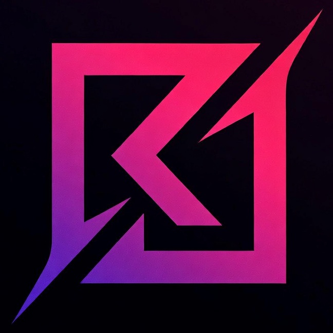

<p align="center">
  
</p>

<p align="center">
  <strong>Personal Portfolio Site</strong><br/>
  Built with React + Vite
</p>

<p align="center">
  <a href="https://github.com/rjchicago/RJ/actions"></a>
  <a href="https://hub.docker.com/r/rjchicago/rj"></a>
</p>

---

## 🚀 Quick Start

### Docker (Recommended)

```bash
docker run -p 3000:80 rjchicago/rj
```

Visit [http://localhost:3000](http://localhost:3000)

### Docker Compose

```bash
docker-compose up
```

### Local Development

```bash
cd web
npm install
npm run dev
```

---

## 🛠️ Tech Stack

- **React 19** — UI framework
- **Vite 7** — Lightning-fast build tool
- **Nginx** — Production server
- **Docker** — Containerized deployment

---

## 📦 Build

```bash
# Build Docker image
docker-compose build

# Or manually
docker build -t rjchicago/rj .
```

---

## 📄 License

MIT
