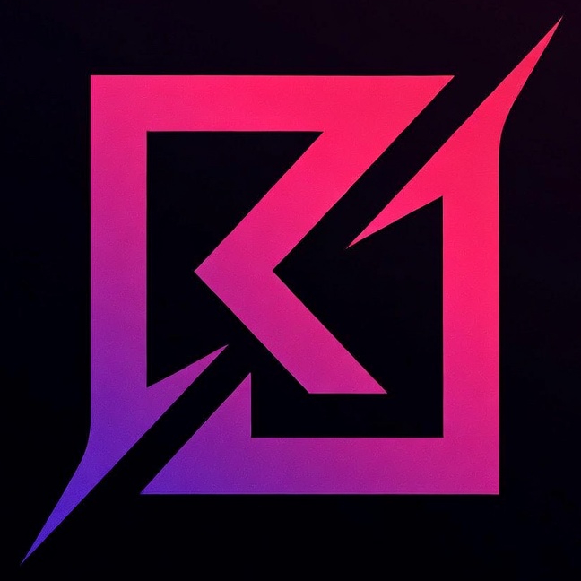

<p align="center">
  
</p>

<p align="center">
  <strong>Personal Portfolio Site</strong><br/>
  Built with React + Vite
</p>

<p align="center">
  <a href="https://github.com/rjchicago/RJ/actions"></a>
  <a href="https://hub.docker.com/r/rjchicago/rj"></a>
</p>

---

## 🚀 Quick Start

### Docker Compose (Recommended)

```bash
docker compose up --build
```

Visit [http://localhost:5173](http://localhost:5173)

Docker Compose runs the Vite dev server with hot reload and the contact API service. Vite proxies `/api/*` to the API container.

### Local Development

```bash
cd web
npm install
npm run dev
```

In another terminal:

```bash
cd api
npm run dev
```

The standalone Vite dev server proxies `/api/*` to `http://localhost:3001` by default. Override with `VITE_API_PROXY_TARGET` if the API runs on another port.

---

## ✉️ Contact Form

The contact form posts to `POST /api/contact`. The browser never talks to Resend directly.

Flow:

1. React contact form loads runtime config from `GET /api/config`.
2. If Turnstile is configured, the form renders the Cloudflare widget.
3. Form submits contact details plus the Turnstile token to `/api/contact`.
4. API validates the request, checks the honeypot and rate limit, verifies Turnstile, then sends the email through Resend.

The API also exposes `GET /health` for service checks.

### Environment

Create `.env` from `.env.example`:

```env
RESEND_API_KEY=
CONTACT_TO_EMAIL=rjchicago.llc@gmail.com
RESEND_FROM_EMAIL=contact@rjchicago.com
TURNSTILE_SECRET_KEY=
TURNSTILE_SITE_KEY=
```

Required:

- `RESEND_API_KEY`: Resend API key.
- `TURNSTILE_SECRET_KEY`: Cloudflare Turnstile secret key when captcha is enabled.
- `TURNSTILE_SITE_KEY`: Cloudflare Turnstile public site key returned by `/api/config`.

Optional:

- `CONTACT_TO_EMAIL`: destination inbox. Defaults to `rjchicago.llc@gmail.com`.
- `RESEND_FROM_EMAIL`: verified Resend sender. Defaults to Resend's onboarding sender for development, but production should use a verified domain/address.

### Resend Setup

1. Create a Resend API key.
2. Verify the sending domain or sender address in Resend.
3. Set `RESEND_FROM_EMAIL` to the verified sender.
4. Keep visitor email addresses in `reply_to`; do not send mail `from` the visitor's address.

### Turnstile Setup

1. Create a Cloudflare Turnstile widget.
2. Use Managed mode.
3. Add allowed hostnames:
   - `localhost` for local testing
   - `www.rjchicago.com`
   - `rjchicago.com`
4. Put the site key in `TURNSTILE_SITE_KEY`.
5. Put the secret key in `TURNSTILE_SECRET_KEY`.

If `TURNSTILE_SECRET_KEY` is set but `TURNSTILE_SITE_KEY` is missing, the form will not submit because the backend requires captcha but the frontend cannot render it.

---

## 🛠️ Tech Stack

- **React 19** — UI framework
- **Vite 7** — Lightning-fast build tool
- **Node 22** — Contact API
- **Nginx** — Production server
- **Resend** — Email delivery
- **Cloudflare Turnstile** — Contact form bot protection
- **Docker** — Containerized deployment

---

## 📦 Build

```bash
# Build Docker images
docker compose build

# Or manually build the static web image
docker build -t rjchicago/rj .

# Or manually build the contact API image
docker build -f api/Dockerfile -t rjchicago/rj-api .
```

---

## 📄 License

MIT
